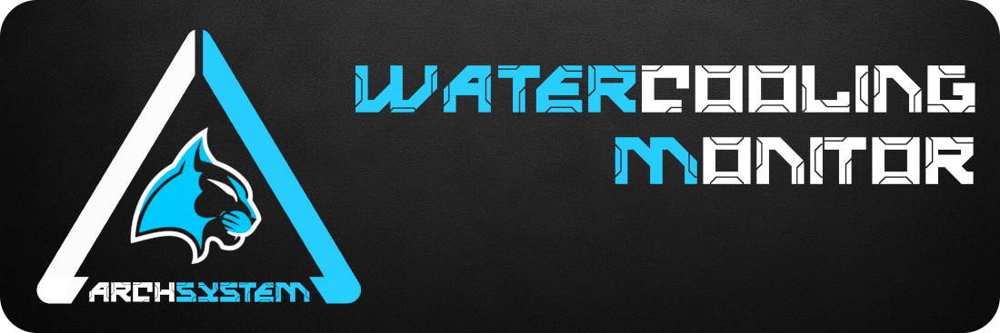
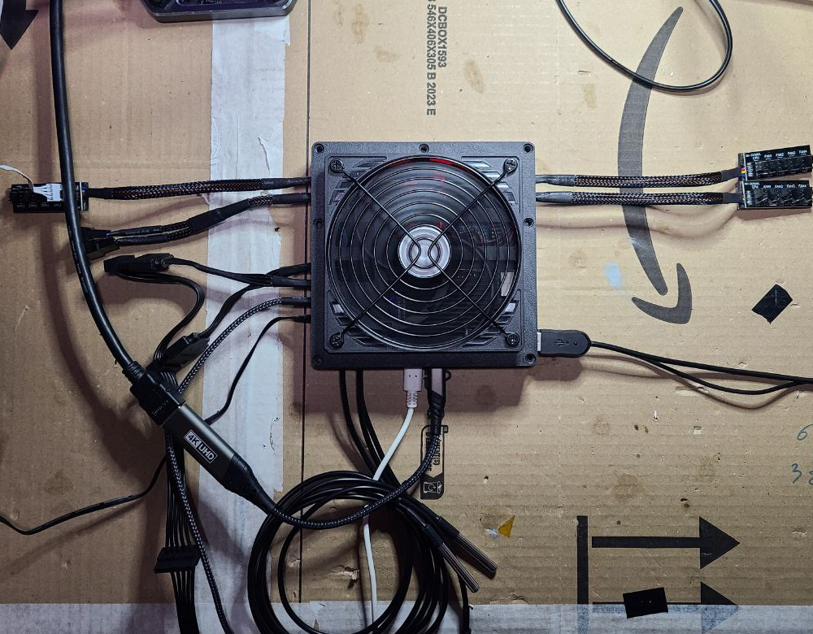
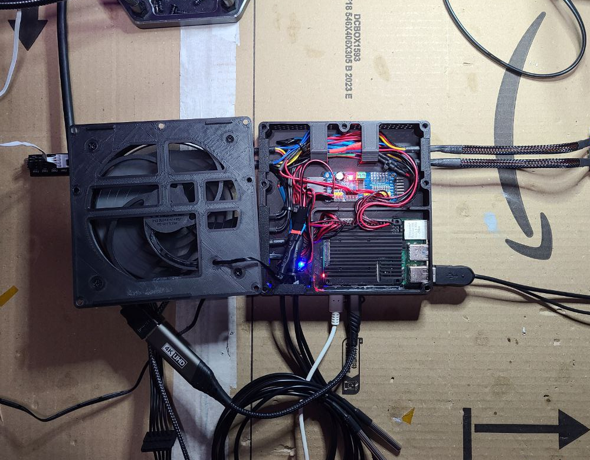
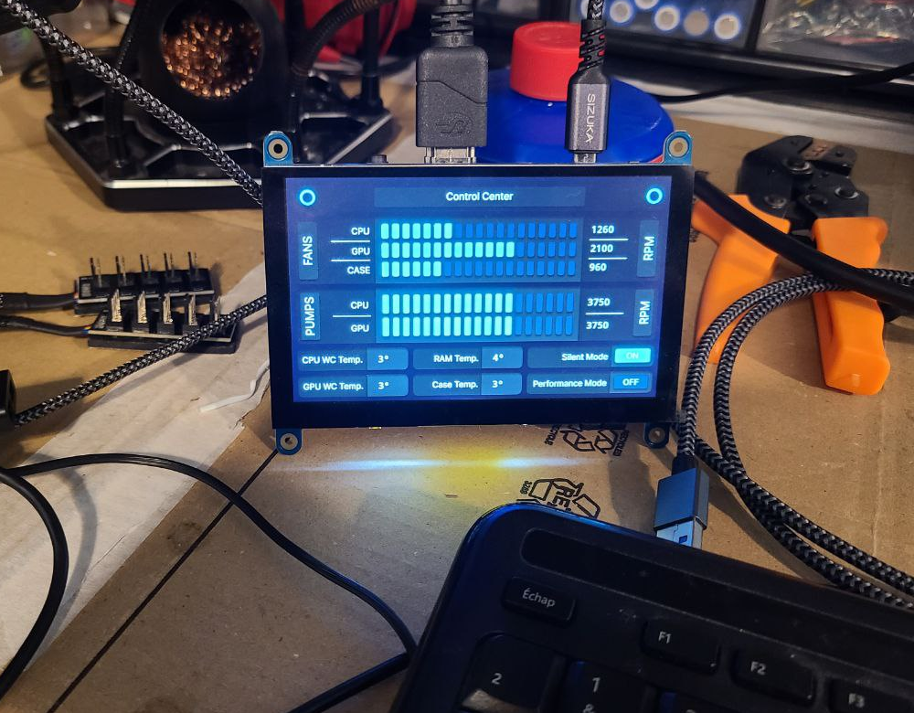
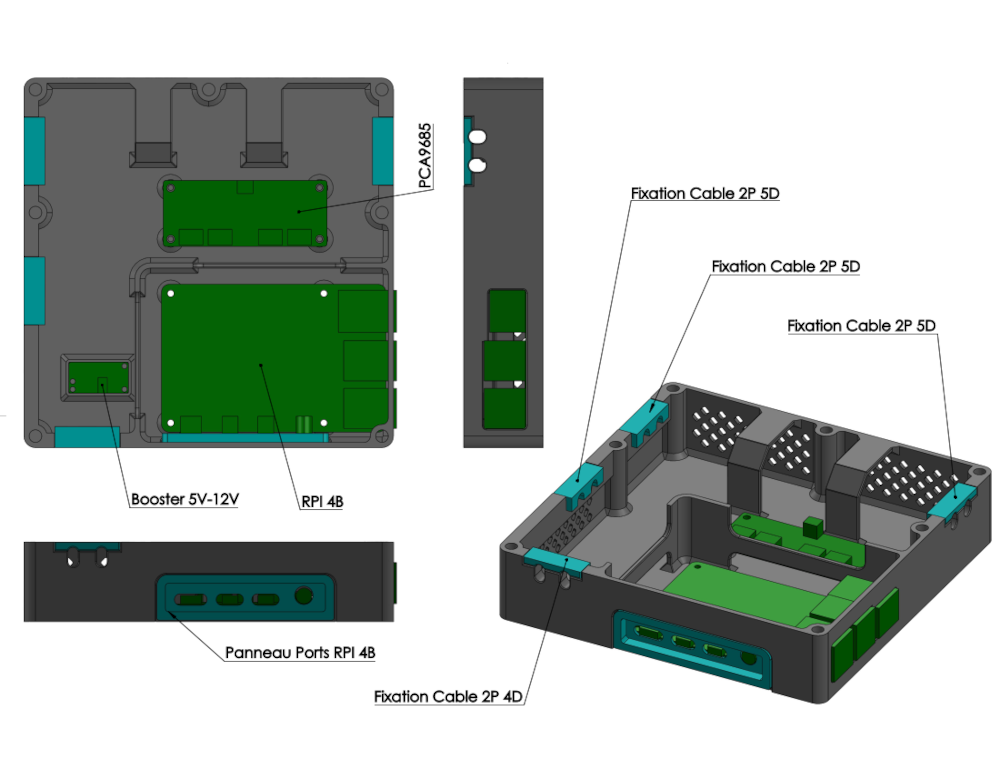

Archmonitor est un module de gestion autonome de refroidissement liquide. 
Cette première version beta fonctionne sur un `Raspberry PI 4B` et prend en charge la configuration suivante :

- Deux pompes
- Deux sondes pour la température de liquide
- Une sonde pour le boitier
- Trois circuits indépendants de cinq ventilateurs
- Un circuit global `ARGB2`
- Un écran tactile de contrôle

Les configurations possibles sous cette version sont de :

- Deux modes de refroidissement configurable
- Trois modes configurables pour le circuit `ARGB2`

Le logiciel Archmonitor est basé sur la surcouche `ArchGUI` lui-même basé sur `FreeSimpleGUI` et sur `ws2812.py`. 
Ce programme fonctionne sur un `Raspberry PI 4B` avec le dernier `Raspberry Pi OS 64Bits` comme OS.<br/><br/>


⚠️ Ce module est encore en phase beta. De nombreuses améliorations et possibilités vont être apportées dans les mois à venir.<br/><br/>
Les améliorations déjà prévues sont : 

- Une configuration de plusieurs modes lumineux supplémentaires directement via l’écran tactile.
- Une gestion des modes lumineux par rapport au démarrage et à l’arrêt de l’ordinateur.
- Configuration des modes `silent` et `performance` via l’écran tactile.
- Démarrage de l’ordinateur via l’écran tactile.
- Ajout d’un second circuit ARGB2 pour avoir deux gestions lumineuses en tandem.
- Ajout d’un second écran pour l’affichage de données ou personnage animé.

<br/>

| Boitier prototype fermé               | Boitier prototype ouvert              |
|---------------------------------------|---------------------------------------|
|  |  |

| Affichage sur écran tactile           | STL disponible pour impression 3D     |
|---------------------------------------|---------------------------------------|
|  |  |

<br/>

Ces photos sont faites à partir du prototype. Elles ne sont plus à jour.<br/>
Je referais des photos à la prochaine version dans de bonnes conditions.

<br/>


## 😊 Alimentation et principe de fonctionnement :

### Les alimentations :

Le Raspberry PI est alimenté par un USB3.2 interne de la carte mère.
Il faut veiller à ce que les ports USB reste alimenté après l’arrêt de l’ordinateur, voir dans le BIOS pour paramétrer 
cela si ce n’est pas d’usine.<br/>

L’écran est alimenté via un USB dédier du Raspberry PI ou via l’USB du tactile selon les modèles.<br/>

Le ventilateur du Raspberry est alimenté via le 5 V du PI élevé à 12 V via le boosteur, voir les câblages dans la partie dédiée ci-dessous.

Les HUBs des ventilateurs ainsi que les deux 4-Pins des pompes sont alimentés via le cable SATA de l’alimentation de l’ordinateur. Ils ne sont donc pas alimentés lorsque l’ordinateur est éteint.

Le circuit ARGB2 est alimenté via l’USB qui alimente le PI, le circuit ARGB2 reste donc alimenté une fois l’ordinateur éteint.

### Le fonctionnement :

Le Raspberry PI et l’écran restent toujours alimenté. L’écran peut donc piloter l’Archmonitor avec le PC éteint pour gérer le circuit ARGB2.
Une fois l’ordinateur démarré, le Raspberry PI contrôle les signaux PWM des différentes pompes et HUBs de ventilateur par rapport aux paramètres donnés dans le fichier `config.json` et aux températures récupérées par les sondes.

<br/>

## 🛠️ Lien externe :

- [`Raspberry Pi OS`](https://www.raspberrypi.com/software/)
- [`ws2812-spi`](https://github.com/joosteto/ws2812-spi)

<br/>

## 🛠️ Matériel manufacturé :


| Pièces                  | Aperçu                                                                                       | Achat                                           |
|-------------------------|----------------------------------------------------------------------------------------------|-------------------------------------------------|
| 1x Raspberry PI 4B      | [`Image`](https://github.com/archprojectdev/archmonitor/blob/main/support/preview/RPI4B.png) | [`Amazon`](https://www.amazon.fr/dp/B09TTNF8BT) |
| 1x Dissipateur          | [`Image`](https://github.com/archprojectdev/archmonitor/blob/main/support/preview/heat_sink.png) | [`Amazon`](https://www.amazon.fr/dp/B08N617L1J) |
| 1x PAD Cuivre 1.5mm     | [`Image`](https://github.com/archprojectdev/archmonitor/blob/main/support/preview/pad_cuivre.png) | [`Amazon`](https://www.amazon.fr/dp/B07G73J1T8) |
| 1x Ventilateur 120mm    | [`Image`](https://github.com/archprojectdev/archmonitor/blob/main/support/preview/120mm.png) | [`Amazon`](https://www.amazon.fr/dp/B09RWTCXRR) |
| 1x Contrôleur PCA9685   | [`Image`](https://github.com/archprojectdev/archmonitor/blob/main/support/preview/PCA9685.png) | [`Amazon`](https://www.amazon.fr/dp/B072N8G7Y9) |
| 1x Boosteur 5v-12v      | [`Image`](https://github.com/archprojectdev/archmonitor/blob/main/support/preview/boosteur_5v_12v.png) | [`Amazon`](https://www.amazon.fr/dp/B0CW9P4CQP) |
| 3x Sonde DS18B20        | [`Image`](https://github.com/archprojectdev/archmonitor/blob/main/support/preview/DS18B20.png) | [`Amazon`](https://www.amazon.fr/dp/B075FYYLLV) |
| 3x HUBS FAN 4 PINS      | [`Image`](https://github.com/archprojectdev/archmonitor/blob/main/support/preview/hub_fan.png) | [`Amazon`](https://www.amazon.fr/dp/B08XWWXBYD) |
| 2x Cables FAN 4 PINS    | [`Image`](https://github.com/archprojectdev/archmonitor/blob/main/support/preview/cable_4_pins.png) | [`Amazon`](https://www.amazon.fr/dp/B01N1Z3FYD) |
| 1x HUB ARGB2 + Cable    | [`Image`](https://github.com/archprojectdev/archmonitor/blob/main/support/preview/hub_argb2_cable.png) | [`Amazon`](https://www.amazon.fr/dp/B0D2SMNKZY) |
| 1x Écran 800x480        | [`Image`](https://github.com/archprojectdev/archmonitor/blob/main/support/preview/screen_800x480.png) | [`Amazon`](https://www.amazon.fr/dp/B096ZSZFC8) |
| 1x Cable Micro HDMI     | [`Image`](https://github.com/archprojectdev/archmonitor/blob/main/support/preview/cable_microHDMI.png) | [`Amazon`](https://www.amazon.fr/dp/B09J4HMP25) |
| 1x Cable USB 3.2        | [`Image`](https://github.com/archprojectdev/archmonitor/blob/main/support/preview/USB3.2.png) | [`Amazon`](https://www.amazon.fr/dp/B0BWHZBPGJ) |
| 2x Cable USB-A Mini-B   | [`Image`](https://github.com/archprojectdev/archmonitor/blob/main/support/preview/usbaminib.png) | [`Amazon`](https://www.amazon.fr/dp/B089F9V5GK) |
| 1x Cable extension SATA | [`Image`](https://github.com/archprojectdev/archmonitor/blob/main/support/preview/sata_power.png) | [`Amazon`](https://www.amazon.fr/dp/B07C71J8LL) |

<br/>

⚠️ Les liens vers Amazon sont le matériel que j’ai utilisé, c’est simplement indicatif.<br/>
⚠️ Suivant l’écran utilisé les câbles nécessaires peuvent varier.

<br/>

## 🛠️ Impression 3D :

| Pièces                  | Fichiers                                                                                                                                                                                                                     |
|-------------------------|------------------------------------------------------------------------------------------------------------------------------------------------------------------------------------------------------------------------------|
| 1x Boitier              | [`Plan PDF`](https://github.com/archprojectdev/archmonitor/blob/main/support/blueprint/Boitier/Boitier.pdf) - [`STL`](https://github.com/archprojectdev/archmonitor/blob/main/support/blueprint/Boitier/Boitier.STL)         |
| 1x Couvercle            | [`Plan PDF`](https://github.com/archprojectdev/archmonitor/blob/main/support/blueprint/Couvercle/Couvercle.pdf) - [`STL`](https://github.com/archprojectdev/archmonitor/blob/main/support/blueprint/Couvercle/Couvercle.STL) |
| 1x Fixation_Cable_2P_4D | [`Plan PDF`](https://github.com/archprojectdev/archmonitor/blob/main/support/blueprint/Fixation_Cable_2P_4D/Fixation_Cable_2P_4D.pdf) - [`STL`](https://github.com/archprojectdev/archmonitor/blob/main/support/blueprint/Fixation_Cable_2P_4D/Fixation_Cable_2P_4D.STL)         |
| 3x Fixation_Cable_2P_5D | [`Plan PDF`](https://github.com/archprojectdev/archmonitor/blob/main/support/blueprint/Fixation_Cable_2P_5D/Fixation_Cable_2P_5D.pdf) - [`STL`](https://github.com/archprojectdev/archmonitor/blob/main/support/blueprint/Fixation_Cable_2P_5D/Fixation_Cable_2P_5D.STL)         |
| 1x Panneau_Ports_RPI_4B | [`Plan PDF`](https://github.com/archprojectdev/archmonitor/blob/main/support/blueprint/Panneau_Ports_RPI_4B/Panneau_Ports_RPI_4B.pdf) - [`STL`](https://github.com/archprojectdev/archmonitor/blob/main/support/blueprint/Panneau_Ports_RPI_4B/Panneau_Ports_RPI_4B.STL)         |

Plan de montage général : [`Plan PDF`](https://github.com/archprojectdev/archmonitor/blob/main/support/blueprint/Archmonitor.pdf)<br/><br/>
⚠️ Le PAD de cuivre n’est pas visible sur le plan. Il prend place dans l'encoche du boitier sous le PI avec un PAD thermique en silicone entre le PI et le PAD en cuivre.

<br/>

## 🛠️ Câblage :

| Circuit | Fichiers                                          |
|---------|---------------------------------------------------|
| Général | [`Plan PDF`](https://github.com/archprojectdev/archmonitor/blob/main/support/circuit/General.pdf) |
| RPI     | [`Plan PDF`](https://github.com/archprojectdev/archmonitor/blob/main/support/circuit/RPI.pdf) |
| Sensors | [`Plan PDF`](https://github.com/archprojectdev/archmonitor/blob/main/support/circuit/Sensors.pdf) |

<br/>

## 💻️ Installation de Raspberry Pi OS :
 - Configuration de l’installation via `Raspberry PI Imager` sur Ubuntu ou une autre distribution
 - Installation de `Raspberry Pi OS 64Bits` sur la carte SD
 - Démarrage du PI

Pour plus de simplicité j’utilise l’user `archmonitor`, vous le retrouvez dans les commandes à venir.

<br/>

## 💻 Mise à jour :
```bash
sudo apt-get update && sudo apt-get upgrade
sudo rpi-update
sudo reboot
```

<br/>

## 💻 Activation des ports :

Puis activez dans `Interface Options` les options suivantes :
```bash
sudo raspi-config
     └── Interface Options
         ├── SPI    : Enabled
         └── 1-Wire : Enabled
```

```bash
sudo modprobe w1-gpio
sudo modprobe w1-therm
```

<br/>

## 💻 Modification des fichiers boot :

### 📄 `/boot/firmware/cmdline.txt` ➡️ [`cmdline.txt`](https://github.com/archprojectdev/archmonitor/blob/main/support/file/cmdline.txt)<br>
```bash
sudo nano /boot/firmware/cmdline.txt
```
Ajouter à la fin de la ligne :
```bash
consoleblank=0 spidev.bufsiz=250000
```

### 📄 `/boot/firmware/config.txt` ➡️ [`config.txt`](https://github.com/archprojectdev/archmonitor/blob/main/support/file/config.txt)<br>
```bash
sudo nano /boot/firmware/config.txt
```
En dessous de `# Uncomment some or all of these to enable the optional hardware interfaces`<br>
Modifier le fichier pour obtenir :
```bash
# Uncomment some or all of these to enable the optional hardware interfaces
dtparam=spi=on
dtparam=i2c_arm=on
```
À la fin du fichier après `[all]`<br>
Modifier le fichier pour obtenir :
```bash
[all]
dtoverlay=w1-gpio,gpiopin=4,disable-bt
display_auto_detect=1

force_turbo=1
core_freq=500 
core_freq_min=500

hdmi_cvt=800 480 60 3 0 0 0
hdmi_group=1
hdmi_mode=14
hdmi_boost=7

framebufferheight=480
framebufferwidth=800
```

### Redémarrer le PI : <br>
```bash
sudo reboot
```

<br/>

## 💻 Test de détection des sondes :
```bash
cd /sys/bus/w1/devices/
ls
```

 ```
28-xxxxxxxxxxxx  28-xxxxxxxxxxxx  28-xxxxxxxxxxxx  w1_bus_master1
```

Vous devez voir trois devices commençant par `28-xxxxxxxxxxxx`.<br/>
Rentrez dans une de ces devices afficher les données de la sonde :

```bash
cd 28-xxxxxxxxxxxx
cat w1_slave
```

```bash
52 01 55 00 7f ff 0c 10 53 : crc=53 YES
52 01 55 00 7f ff 0c 10 53 t=21125
```

La deuxième ligne vous indiquera la température de la sonde en millième de degré : `t=21125`<br/>
La sonde indique 21 degrés : `21125 / 100 = 21`

## 💻 Installation des librairies Python :
```bash
sudo apt-get install pigpio python3-pigpio
sudo systemctl enable pigpiod
sudo systemctl start pigpiod 

sudo pip3 install --break-system-packages FreeSimpleGUI pynput screeninfo gpiozero
sudo pip3 install --break-system-packages adafruit-circuitpython-pca9685

sudo reboot
```

<br/>

## 💻 Téléchargement :
📂 Dans le `home` de votre `user`:
```bash
wget https://github.com/archprojectdev/archmonitor/archive/refs/heads/main.zip
unzip main.zip

mv archmonitor-main archmonitor
cd archmonitor

wget https://github.com/archprojectdev/archgui/archive/refs/heads/main.zip
unzip main.zip

mv archgui-main archgui
```

```bash
/home/archmonitor/archmonitor/

├── archgui
│   ├── config
│   │   └── default.json
│   │
│   ├── __init__.py
│   ├── Interpreter.py
│   ├── Model.py
│   ├── README.md
│   ├── Windows.py
│   └── Workarea.py
│   
├── archgui_events
│   └── main.py
│   
├── archgui_windows
│   └── main.json
│   
├── resource
├── support
│   
├── config.json
├── Display.py
├── Listener.py
├── main.py
├── README.md
├── sensors.py
├── Argb.py
└── Temperature.py
```

<br/>

## 💻 Configuration :
📂 Dans le `home` de votre `user`:
```bash
cd archmonitor
python sensors.py
```
```bash
----------------------------------------------
/sys/bus/w1/devices/28-7f79541f64ff/w1_slave - 21
/sys/bus/w1/devices/28-837e541f64ff/w1_slave - 25
/sys/bus/w1/devices/28-d97b541f64ff/w1_slave - 21
```
Avec une source de chaleur, 
faites varier la température de chaque sondes pour déterminer quelle sonde correspond à quel ID.<br/>
Une fois déterminé, modifiez le fichier `/home/archmonitor/archmonitor/config.json` en conséquence :
```bash
"sensors": {
  "wc_cpu": "/sys/bus/w1/devices/28-7f79541f64ff/w1_slave",
  "wc_gpu": "/sys/bus/w1/devices/28-837e541f64ff/w1_slave",
  "case": "/sys/bus/w1/devices/28-d97b541f64ff/w1_slave"
}
```
<br/>

## 💻 Test :
```bash
cd archmonitor
python main.py
```


<br/>
Comme vous pouvez le constater, les erreurs d’écriture/lecture des températures sont fréquentes pour le moment, mais ne posent aucun problème, cela vient de la concurrence entre le process de récupération et l'utilisation du fichier temporaire. Je trouverais une solution plus élégante à l'avenir. 

<br/>
<br/>

## 💻 Création des fichiers Xorg :
### 📄 `/etc/X11/xorg.conf.d/10-blanking.conf` ➡️ [`10-blanking.conf`](https://github.com/archprojectdev/archmonitor/blob/main/support/file/10-blanking.conf)<br>

```bash
sudo nano /etc/X11/xorg.conf.d/10-blanking.conf
```
```bash
Section "Extensions"
    Option      "DPMS" "Disable"
EndSection

Section "ServerLayout"
    Identifier "ServerLayout0"
    Option "StandbyTime" "0"
    Option "SuspendTime" "0"
    Option "OffTime"     "0"
    Option "BlankTime"   "0"
EndSection
```

### 📄 `/etc/X11/xorg.conf.d/10-monitor.conf` ➡️ [`10-monitor.conf`](https://github.com/archprojectdev/archmonitor/blob/main/support/file/10-monitor.conf)<br>
```bash
sudo nano /etc/X11/xorg.conf.d/10-monitor.conf
```
```bash
Section "Monitor"
    Identifier "XWAYLAND0"
    Modeline "800x480_60.00"   29.50  800 824 896 992  480 483 493 500 -hsync +vsync
    Option "PreferredMode" "800x480_60.00"
EndSection

Section "Screen"
    Identifier "HDMI-A-1"
    Monitor "XWAYLAND0"
    DefaultDepth 24
    SubSection "Display"
        Modes "800x480_60.00"
    EndSubSection
EndSection
```

<br/>

## 💻 Création des fichiers de lancement :
### 📄 Créer le fichier : `/home/archmonitor/.bashrc`
```bash
nano .bashrc
>> bash startx.sh
```
### 📄 Créer le fichier : `/home/archmonitor/startx.sh`
```bash
nano startx.sh
>> cd /home/archmonitor/archmonitor
>> startx
```
### 📄 Créer le fichier : `/home/archmonitor/.xinitrc`
```bash
nano .xinitrc
>> exec python /home/archmonitor/archmonitor/main.py
```

<br/>

## 💻 Redémarrage :

Démarrage en mode console avec autologin.

```bash
sudo raspi-config
     └── systeme
         └── boot / Autologin
             └── console Autologin

sudo reboot
```

Si tout c’est bien passé, vous devez arriver sur l’interface de l’Archmonitor.
